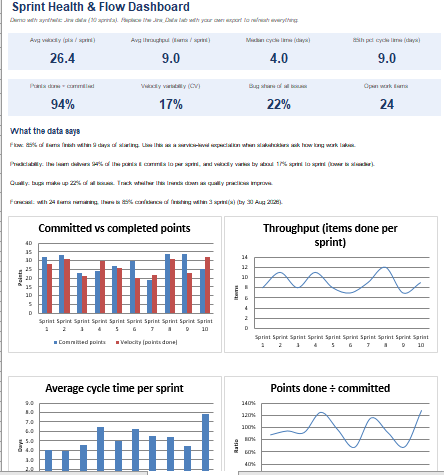

 
# AI-Assisted Agile Toolkit for Scrum Masters

A set of reusable prompts for the work Scrum Masters repeat every sprint: refining backlog items, running retros, summarizing for stakeholders, and explaining metrics. Each prompt includes a template, a review checklist, and a spot to record your own before/after time.

**Companion project:** Sprint Health & Flow Dashboard (Jira + Excel).

---

## Ground rules

1. **No confidential data.** Replace names, customers, and internal project names with placeholders before pasting anything into an AI tool.
2. **AI drafts, you decide.** Every output gets a human review. The checklists below say what to look for.
3. **Give context.** Output quality depends on the team, product, and audience details you put in the prompt.
4. **Measure it.** Time yourself on 3 real tasks per prompt, with and without AI, and fill in the results table at the bottom. Concrete numbers are what make this credible in an interview.

---

## 1. Rough notes → user stories with acceptance criteria

**Use when:** a stakeholder email, meeting notes, or a one-line request needs to become refinement-ready backlog items.

```
You are an experienced agile coach helping a Scrum team refine its backlog.

Context:
- Product: [one sentence]
- Users: [personas]
- Team's Definition of Done: [paste or summarize]

Below are raw notes. Turn them into user stories.

For each story provide:
1. Title
2. Story in the format "As a [user], I want [capability] so that [benefit]"
3. Acceptance criteria in Given/When/Then format (3 to 5 per story)
4. Assumptions or open questions I should confirm with the Product Owner
5. A rough size flag: small / medium / too big (needs splitting)

Do not invent requirements that are not in the notes. If something is unclear, list it under open questions instead of guessing.

Notes:
[paste notes]
```

**Review checklist**
- [ ] Every story traces back to something in the notes
- [ ] Acceptance criteria are testable, not vague ("fast", "user-friendly")
- [ ] Open questions are real gaps, not filler
- [ ] Stories are independent enough to be pulled into a sprint

---

## 2. Splitting a story that is too big

**Use when:** an item keeps carrying over or the team says "this is an 8 and we don't know why."

```
This user story is too large for one sprint:

[paste story + acceptance criteria]

Suggest 3 different ways to split it (for example by workflow step, by user type, by data variation, by simple-to-complex, or by happy path vs edge cases).

For each option:
- List the resulting smaller stories (title + one-line description)
- Say which split delivers value to users earliest
- Note any risk or dependency the split creates

End with the split you would recommend and why.
```

**Review checklist**
- [ ] Each slice delivers something a user could actually notice
- [ ] No slice is just "backend" or "frontend" with no usable outcome
- [ ] Dependencies between slices are stated

---

## 3. Retro feedback → themes and actions

**Use when:** the team has posted 20 to 60 sticky notes and you need to prepare the discussion.

```
Below is anonymous feedback from a sprint retrospective, grouped as "Went well", "Didn't go well", and "Ideas".

Tasks:
1. Group the feedback into 3 to 6 themes. Name each theme and list how many notes belong to it.
2. For each theme, summarize in 1 to 2 sentences what the team is really saying.
3. Flag any theme that has appeared in previous retros (previous themes: [paste or write "none"]).
4. Propose 1 small, concrete experiment per top-2 theme that the team could try next sprint, with a way to tell if it worked.
5. Note anything that sounds like an organizational impediment I should escalate rather than ask the team to fix.

Keep the team's own language where possible. Do not name or guess who wrote anything.

Feedback:
[paste notes]
```

**Review checklist**
- [ ] Themes reflect the notes, not generic agile advice
- [ ] Experiments are small and measurable
- [ ] You read the raw notes too; AI can hide a quiet but important comment

---

## 4. Sprint review summary for stakeholders

**Use when:** you need a short written recap of what was delivered, in language non-technical readers understand.

```
Write a sprint review summary for stakeholders.

Audience: [e.g., business sponsors, not technical]
Tone: clear, factual, no jargon
Length: under 200 words

Include:
- Sprint goal and whether it was met
- What was delivered, described by user benefit rather than ticket title
- What was not finished and why (one honest sentence)
- Risks or decisions needed from stakeholders
- What is planned next

Sprint goal: [text]
Completed items: [list]
Not completed: [list + reason]
Risks / asks: [list]
```

**Review checklist**
- [ ] The "not finished" section is honest, not spun
- [ ] No ticket numbers or internal jargon leaked through
- [ ] Any stakeholder decision needed is stated clearly

---

## 5. Standup / async update digest

**Use when:** the team posts updates in Slack or Teams and you need blockers surfaced quickly.

```
Here are this week's team updates. Produce:
1. A 5-line summary of overall progress
2. A list of blockers, each with: who is affected, what is needed, and who could unblock it
3. Items that look at risk of missing the sprint goal, with your reasoning
4. Any update that appears to conflict with another (possible miscommunication)

Updates:
[paste]
```

**Review checklist**
- [ ] Blockers are specific enough to act on today
- [ ] "At risk" reasoning matches what you know about the team

---

## 6. Metrics → plain-language story

**Use when:** presenting dashboard numbers (see the companion Excel project) to leaders who want the "so what."

```
I'm a Scrum Master. Here are our sprint metrics for the last [N] sprints:

[paste table: velocity, throughput, cycle time, committed vs completed, bug count]

1. Describe the 3 most important patterns in plain language for a non-technical manager.
2. Suggest possible causes for each pattern as hypotheses I should test with the team, not as conclusions.
3. Recommend one experiment per pattern.
4. Warn me about any way these numbers could be misleading (small sample, outliers, changes in team size).
```

**Review checklist**
- [ ] Causes are framed as hypotheses
- [ ] The caveats mention your actual data limits
- [ ] You would be comfortable defending every claim in a room

---

## Before / after results (fill in with your own timings)

| Task | Time without AI | Time with AI | Notes on quality / edits needed |
|---|---|---|---|
| Refine 5 stories from notes | | | |
| Prepare retro themes (40 notes) | | | |
| Write sprint review summary | | | |
| Weekly blocker digest | | | |
| Explain metrics to leadership | | | |

**Suggested way to report it:** "Cut retro prep from 45 to 15 minutes while still reading every raw note, using AI for clustering and drafting only."

---

## Customize it

- Add your team's Definition of Done and product context to a saved system prompt or a Claude Project so you don't repeat it each time.
- Version your prompts. When you improve one, note what changed and why.
- Keep a short "what AI got wrong" log. It shows judgment and makes a great interview story.
